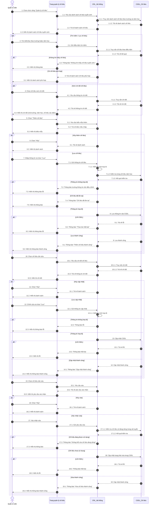

```mermaid
sequenceDiagram
    autonumber
    actor QTV as Quản trị viên
    participant UI as Trang quản lý chỉ tiêu
    participant System as CRL_Hệ thống
    participant DB as CSDL_Chỉ tiêu

    %% 1. XEM DANH SÁCH & TÌM KIẾM
    QTV->>UI: 1: Chọn chức năng "Quản lý chỉ tiêu"
    UI->>System: 1.1: Yêu cầu danh sách chỉ tiêu tuyển sinh
    System->>DB: 1.1.1: Truy vấn danh sách chỉ tiêu theo trường và năm học
    DB-->>System: 1.1.2: Trả về danh sách chỉ tiêu
    System-->>UI: 1.2: Trả về danh sách chỉ tiêu
    UI-->>QTV: 1.3: Hiển thị danh sách chỉ tiêu tuyển sinh

    opt Tìm kiếm / Lọc chỉ tiêu
        QTV->>UI: 2: Tìm kiếm/lọc theo trường hoặc năm học
        UI->>System: 2.1: Gửi điều kiện tìm kiếm
        System->>DB: 2.1.1: Truy vấn chỉ tiêu theo điều kiện
        DB-->>System: 2.1.2: Trả về kết quả
        alt Không tìm thấy chỉ tiêu
            System-->>UI: 2.2: Thông báo "Không tìm thấy chỉ tiêu tuyển sinh."
            UI-->>QTV: 2.3: Hiển thị thông báo
        else Có chỉ tiêu phù hợp
            System-->>UI: 3: Trả về danh sách chỉ tiêu phù hợp
            UI-->>QTV: 3.1: Hiển thị danh sách phù hợp
        end
    end

    opt Xem chi tiết chỉ tiêu
        QTV->>UI: 4: Chọn chỉ tiêu xem chi tiết
        UI->>System: 4.1: Yêu cầu thông tin chi tiết
        System->>DB: 4.1.1: Truy vấn chi tiết
        DB-->>System: 4.1.2: Trả về chi tiết
        System-->>UI: 4.2: Trả về thông tin chi tiết
        UI-->>QTV: 4.3: Hiển thị chi tiết (mã trường, năm học, chỉ tiêu các diện)
    end

    %% 2. THÊM CHỈ TIÊU
    QTV->>UI: 5: Chọn "Thêm chỉ tiêu"
    UI->>System: 5.1: Yêu cầu biểu mẫu thêm
    System-->>UI: 5.2: Trả về biểu mẫu nhập
    UI-->>QTV: 5.3: Hiển thị biểu mẫu

    alt Hủy thêm chỉ tiêu
        QTV->>UI: 6: Chọn "Hủy"
        System-->>UI: 6.1: Trả về danh sách
        UI-->>QTV: 6.2: Hiển thị danh sách
    else Lưu chỉ tiêu
        QTV->>UI: 7: Nhập thông tin và chọn "Lưu"
        UI->>System: 7.1: Gửi thông tin chỉ tiêu
        System->>System: 7.1.1: Kiểm tra tính hợp lệ
        System->>DB: 7.1.2: Kiểm tra trùng chỉ tiêu năm học
        DB-->>System: 7.1.3: Kết quả kiểm tra
        alt Thông tin không hợp lệ
            System-->>UI: 7.2: Thông báo trường thông tin cần điều chỉnh
            UI-->>QTV: 7.3: Hiển thị thông báo lỗi
        else Chỉ tiêu đã tồn tại
            System-->>UI: 7.4: Thông báo "Chỉ tiêu đã tồn tại"
            UI-->>QTV: 7.5: Hiển thị thông báo
        else Thông tin hợp lệ
            System->>DB: 8: Lưu thông tin vào CSDL
            alt Lỗi CSDL
                DB-->>System: 8.1: Trả về lỗi
                System-->>UI: 8.2: Thông báo "Thao tác thất bại"
                UI-->>QTV: 8.3: Hiển thị thông báo lỗi
            else Lưu thành công
                DB-->>System: 9: Lưu thành công
                System-->>UI: 9.1: Thông báo "Thêm chỉ tiêu thành công"
                UI-->>QTV: 9.2: Hiển thị thông báo thành công
            end
        end
    end

    %% 3. CẬP NHẬT CHỈ TIÊU
    QTV->>UI: 10: Chọn chỉ tiêu cần sửa
    UI->>System: 10.1: Yêu cầu chi tiết chỉ tiêu
    System->>DB: 10.1.1: Truy vấn chi tiết
    DB-->>System: 10.1.2: Trả về chi tiết
    System-->>UI: 10.2: Trả về thông tin chi tiết
    UI-->>QTV: 10.3: Hiển thị chi tiết

    alt Hủy cập nhật
        QTV->>UI: 11: Chọn "Hủy"
        System-->>UI: 11.1: Trả về danh sách
        UI-->>QTV: 11.2: Hiển thị danh sách
    else Lưu cập nhật
        QTV->>UI: 12: Chỉnh sửa và chọn "Lưu"
        UI->>System: 12.1: Gửi thông tin cập nhật
        System->>System: 12.1.1: Kiểm tra tính hợp lệ
        alt Thông tin không hợp lệ
            System-->>UI: 12.2: Thông báo lỗi
            UI-->>QTV: 12.3: Hiển thị thông báo lỗi
        else Thông tin hợp lệ
            System->>DB: 13: Cập nhật CSDL
            alt Lỗi CSDL
                DB-->>System: 13.1: Trả về lỗi
                System-->>UI: 13.2: Thông báo thất bại
                UI-->>QTV: 13.3: Hiển thị lỗi
            else Cập nhật thành công
                DB-->>System: 14: Cập nhật thành công
                System-->>UI: 14.1: Thông báo "Cập nhật thành công"
                UI-->>QTV: 14.2: Hiển thị thông báo thành công
            end
        end
    end

    %% 4. XÓA CHỈ TIÊU
    QTV->>UI: 15: Chọn chỉ tiêu cần xóa
    UI->>System: 15.1: Yêu cầu xóa
    System-->>UI: 15.2: Trả về yêu cầu xác nhận
    UI-->>QTV: 15.3: Hiển thị yêu cầu xác nhận

    alt Hủy xóa
        QTV->>UI: 16: Chọn "Hủy"
        System-->>UI: 16.1: Trả về danh sách
        UI-->>QTV: 16.2: Hiển thị danh sách
    else Xác nhận xóa
        QTV->>UI: 17: Xác nhận xóa
        UI->>System: 17.1: Gửi yêu cầu xóa
        System->>DB: 17.1.1: Kiểm tra chỉ tiêu có đang dùng trong xét tuyển
        DB-->>System: 17.1.2: Kết quả kiểm tra
        alt Chỉ tiêu đang được sử dụng
            System-->>UI: 17.2: Thông báo "Không thể xóa chỉ tiêu đang dùng"
            UI-->>QTV: 17.3: Hiển thị thông báo
        else Chỉ tiêu chưa sử dụng
            System->>DB: 18: Cập nhật trạng thái xóa trong CSDL
            alt Lỗi CSDL
                DB-->>System: 18.1: Trả về lỗi
                System-->>UI: 18.2: Thông báo thất bại
                UI-->>QTV: 18.3: Hiển thị lỗi
            else Xóa thành công
                DB-->>System: 19: Cập nhật thành công
                System-->>UI: 19.1: Thông báo "Xóa chỉ tiêu thành công"
                UI-->>QTV: 19.2: Hiển thị thông báo thành công
            end
        end
    end
```
